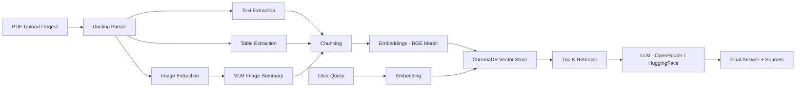

# 🚗 Multimodal RAG System for Tata Altroz Owner's Manual

An end-to-end **Multimodal Retrieval-Augmented Generation (RAG)** system that enables intelligent querying of the **Tata Altroz owner’s manual** using text, tables, and images.

***

## 📌 Problem Statement

### 1. Domain Identification
This project is situated in the domain of **Automotive Engineering and Customer Experience**, with a focus on post-sales vehicle usage and support systems. Modern vehicles are increasingly complex, incorporating advanced safety systems, electronic controls, infotainment functions, and feature-rich interfaces. As a result, vehicle owners rely heavily on owner’s manuals to understand vehicle functionality, troubleshooting procedures, maintenance requirements, and safety guidelines.

***

### 2. Problem Description
Vehicle owner’s manuals, such as the **Tata Altroz Owner’s Manual**, contain critical information about vehicle operation, maintenance, dashboard indicators, safety systems, infotainment features, and troubleshooting procedures. These manuals are inherently **multimodal**, consisting of textual descriptions, structured tables, warning notes, and visual diagrams.

The Altroz documentation ecosystem also spans multiple official manuals and supplements, such as:

- **Altroz BS6 PH2**
- **Altroz Racer**
- **Supplement for Altroz CNG**
- **Altroz_iTPMS**
- **Infotainment User Manual Altroz MCE**

This makes information retrieval even more challenging for users.

Despite their importance, these documents present significant usability challenges:

- Information is **highly fragmented** across multiple sections and manuals.
- Users struggle to map **real-world problems to the correct manual section**.
- Traditional keyword search often fails because of **technical automotive terminology**.
- Critical safety and maintenance instructions are buried in dense text.

***

### 3. Why This Problem Is Unique

- Safety-critical instructions require **high accuracy**.
- Presence of **tables and structured data**.
- Use of **technical automotive terminology**.
- Inclusion of **visual diagrams and dashboard indicators**.
- Context-dependent answers based on vehicle condition, model type, and feature variant.
- Multiple Altroz-related manuals increase retrieval complexity.

***

### 4. Why RAG Is the Right Approach

- Avoids expensive fine-tuning.
- Enables **semantic search** over long manuals.
- Supports **multimodal retrieval** across text, tables, and images.
- Reduces hallucination by grounding responses in source documents.
- Scales easily from one Altroz manual to multiple variants and supplements.

***

### 5. Expected Outcomes

The system enables:

- Troubleshooting queries:
  - *"Why is my Altroz not starting?"*
  - *"What does this warning light mean?"*
- Feature explanations:
  - *"How does ABS work in Altroz?"*
  - *"How do I use the infotainment system?"*
- Safety understanding:
  - *"When do airbags deploy?"*
  - *"What are the child safety precautions?"*
- Procedural guidance:
  - *"How to change a tyre?"*
  - *"How to check tyre pressure or iTPMS warnings?"*
- Manual navigation:
  - *"Where can I find CNG-specific instructions?"*

***

### 6. Future Scope

- Expand from **Altroz BS6 PH2** to **Altroz Racer**, **Altroz CNG**, **Altroz_iTPMS**, and infotainment manuals.
- Add voice assistant integration for hands-free support.
- Improve image and diagram understanding using vision-language models.
- Integrate real-time diagnostics and maintenance alerts.
- Extend the platform to multiple Tata vehicle models.

***

## 🏗️ Architecture Overview

### 🔄 Pipeline Flow

***

## ⚙️ System Components

### 1. Document Ingestion
- Upload official **Tata Altroz manuals** in PDF format.
- Parse multimodal content using **Docling** or a comparable document parser.
- Extract text, tables, and images from each manual.

### 2. Multimodal Processing
- **Text**: cleaned, chunked, and embedded.
- **Tables**: retained as structured retrieval units.
- **Images/Diagrams**: summarized using a **Vision-Language Model (VLM)**.

### 3. Retrieval Layer
- Use **BGE embeddings** to convert chunks into vector representations.
- Store embeddings in **ChromaDB**.
- Retrieve top-k relevant chunks based on semantic similarity.

### 4. Generation Layer
- Pass retrieved context to an LLM through **OpenRouter** or **HuggingFace**.
- Generate a grounded response with supporting context and source traceability.

***

## 📂 Suggested Data Sources

Official Tata Altroz documentation may include:

- **Altroz BS6 PH2**
- **Altroz Racer**
- **Supplement for Altroz CNG**
- **Altroz_iTPMS**
- **Infotainment User Manual Altroz MCE**

These manuals together provide a realistic multimodal testbed for a vehicle-manual RAG system.

***

## 💡 Sample User Queries

- *What does the engine warning light indicate in Tata Altroz?*
- *How do I use the Altroz infotainment controls?*
- *What are the precautions for airbag deployment?*
- *How often should maintenance checks be performed?*
- *Where are the CNG-related operating instructions?*
- *How do I understand iTPMS alerts?*

***

## ✅ Key Benefits

- Faster access to relevant information from long manuals.
- Better understanding of technical and safety-related topics.
- Improved owner experience through natural language interaction.
- Reduced dependence on manual browsing and exact keyword matching.
- Support for multimodal content, including tables and diagrams.

***

## 🚀 Future Enhancements

- Add chat memory for multi-turn troubleshooting.
- Support voice-based question answering.
- Build a dashboard UI for model-wise manual selection.
- Add citation-backed answers with manual page references.
- Integrate OCR improvements for scanned manual pages.

***

## 🧠 Tech Stack

- **Document Parsing:** Docling / PDF parsing tools
- **Embeddings:** BGE embedding model
- **Vector Database:** ChromaDB
- **LLM Backend:** OpenRouter / HuggingFace
- **VLM Support:** Vision-Language Model for image understanding
- **Application Layer:** Python / Streamlit / FastAPI / Notebook pipeline

***

## 📌 Use Case Summary

This project demonstrates how a **multimodal RAG pipeline** can transform the **Tata Altroz owner's manual** into an intelligent assistant capable of answering user questions grounded in official manual content. It is especially relevant for automotive support, intelligent documentation systems, and AI-powered post-sales assistance.
